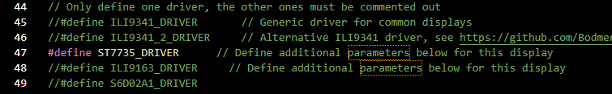
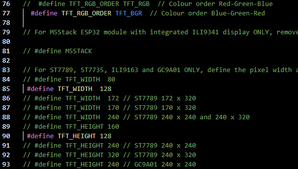
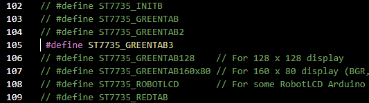
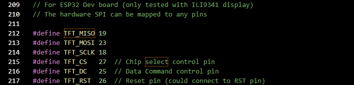
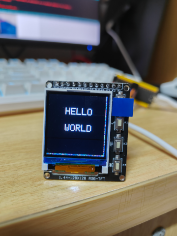
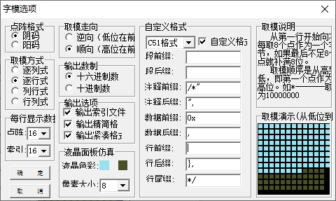
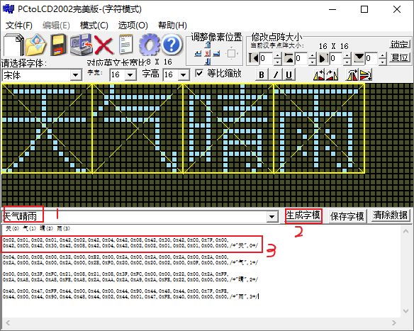

# 基于ESP32制作的HoloCubic

## 

## 材料


## 硬件连接


## 环境搭建


## 屏幕驱动
### 下载TFT_eSPI
* 在Arduino的主界面依次点击：文件-首选项，在附加开发板管理器网站中输入：
>https://dl.espressif.com/dl/package_esp32_index.json

* 随后点击：项目-加载库-管理库，在弹出的库管理器中搜索TFT_eSPI并安装即可
>搜索结果很多，往下翻到by Bodmer

### TFT_eSPI的初始化
[TFT_eSPI](https://github.com/Bodmer/TFT_eSPI)是一个适用于 ESP8266 和 ESP32 平台的开源 Arduino 库，专门为驱动小型彩色 TFT 显示屏设计。它通过 SPI 接口与显示屏通信，提供了丰富的绘图功能和灵活的自定义配置，通过修改`User_Setup.h`文件可以调整引脚配置、显示屏型号和其他参数。

为了正确驱动我手上的这块7735屏幕，需要对`User_Setup.h`文件进行一些自定义设置：

>该文件位于`C:\Users\用户名\Documents\Arduino\libraries\TFT_eSPI`

1. 选择驱动对应的屏幕型号



2. 设置显示颜色顺序和屏幕大小



3. 指定屏幕型号，预防屏幕右侧和下方出现彩条 


>代码段中的每一行（例如#define ST7735_GREENTAB3）都是用于选择特定类型的ST7735显示屏。由于ST7735有多种版本，选择错误的定义可能导致颜色错误、镜像显示或边缘出现杂点。

4. 设置SPI引脚，和连线保持一致




### 让屏幕显示"HELLO WORLD"

将下面的代码输入Arduino并点击上传：

```
#include <SPI.h>
#include <TFT_eSPI.h>

TFT_eSPI tft = TFT_eSPI(); 

void setup() {
  // put your setup code here, to run once:
  tft.init();                              // 初始化
  tft.fillScreen(TFT_BLACK);               // 设置屏幕颜色
  tft.setTextColor(TFT_WHITE);             // 设置文本颜色为白色
  tft.setTextSize(2);                      // 设置文字的大小 (1~7)
  tft.setCursor(40, 30, 1);                // 设置坐标和字体样式
  tft.println("HELLO");                    // 显示文字
  tft.setCursor(40, 65, 1);                // 设置坐标和字体样式
  tft.println("WORLD");                    // 显示文字
}
void loop() {
  // put your main code here, to run repeatedly:
}
```
Arduino的控制台提示Connecting时，长按5秒boot，使ESP32进入下载模式，待烧录完成后按Reset即可：



### 制作汉字字库
汉字的结构复杂，形状多样，无法使用简单的字形库直接显示。而在嵌入式系统中，RAM和ROM的存储空间有限，因此我们需要将汉字抽象成点阵数据。点阵数据通过简化字符图形，将复杂的汉字转化为固定大小的像素矩阵，可以更有效地利用有限的存储资源。而点阵数据的集合就是字库。
字库文件包括以下这些部分：
* 点阵数据：项目需要用到的所有汉字的点阵数据，每个汉字用一系列16进制数表示
* 字模结构体：一个汉字的点阵数据、索引和宽度的组合成一个字模数据，用结构体定义
* 结构体数组：存储字模结构体的数组

代码结构如下：
```
// Part1. 点阵数据
// const 定义使数据存储在单片机的ROM中，节约RAM资源
const unsigned char CH_tian[] = 
{
    0x02,0x01,0x02,0x01,0x42,0x02,0x42,0x04,0x42,0x08,0x42,0x30,0x42,0xC0,0x7F,0x00,
0x42,0xC0,0x42,0x30,0x42,0x08,0x42,0x04,0x42,0x02,0x02,0x01,0x02,0x01,0x00,0x00,/*"天",0*/
};
const unsigned char CH_qi[] = 
{
    0x02,0x01,0x02,0x01,0x42,0x02,0x42,0x04,0x42,0x08,0x42,0x30,0x42,0xC0,0x7F,0x00,
0x42,0xC0,0x42,0x30,0x42,0x08,0x42,0x04,0x42,0x02,0x02,0x01,0x02,0x01,0x00,0x00,/*"天",0*/
};

** [此处省略其它点阵数据] **

//Part.2 字模结构体
struct CN_Character
{
  char  Index[4]; // 汉字内码索引,如"中",在UTF-8编码下，每个汉字占3个字节，第四个是结束符0
  const unsigned char* CH_Id;  // 点阵码数据，存放内码后对应的点阵序列每个字需要32个字节的点阵序列
  unsigned char CH_width;    //序列长度
};

//定义结构数组
const CN_Character hanzi[] =
{
 {"天", CH_tian, 16}, {"气", CH_qi, 16},** [此处省略其它结构体] **
};

```

>取得点阵数据可以使用软件** PCtoLED2002 **,设置如下：


